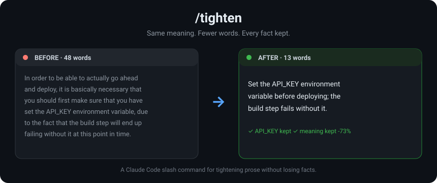

# Tighten

[](https://www.npmjs.com/package/tighten-skill)
[](https://www.npmjs.com/package/tighten-skill)
[](LICENSE)

An agent skill that rewrites long or padded prose to be tight and clear: **same meaning, fewer words, every fact kept.** Works in [Claude Code](https://claude.com/claude-code), Cursor, Windsurf, Codex, Cline, GitHub Copilot, and [50+ other agents](https://github.com/vercel-labs/skills).

It is *not* a summarizer. It cuts filler, hedging, buzzwords, and empty adjectives while keeping every number, path, code block, and caveat verbatim.



## Install

### Any agent (via the `skills` CLI)

Installs the skill into whichever agent you target with `-a`:

```bash
npx skills add raj-khan/tighten                    # Claude Code (default)
npx skills add raj-khan/tighten -a cursor
npx skills add raj-khan/tighten -a windsurf
npx skills add raj-khan/tighten -a codex
npx skills add raj-khan/tighten -a cline
npx skills add raj-khan/tighten -a github-copilot
```

See the full [agent list](https://github.com/vercel-labs/skills) for every supported `-a` value.

### Claude Code plugin

```bash
claude plugin marketplace add raj-khan/tighten
claude plugin install tighten@tighten
```

### Claude Code slash command (npx)

Installs `/tighten` as a slash command:

```bash
npx tighten-skill            # install for your user (~/.claude/commands)
npx tighten-skill --project  # install into the current project (.claude/commands)
```

### By hand

The slash command is one Markdown file, so you can drop it in directly:

```bash
mkdir -p ~/.claude/commands
curl -o ~/.claude/commands/tighten.md \
  https://raw.githubusercontent.com/raj-khan/tighten/main/tighten.md
```

Restart your agent (in Claude Code, run `/help`) and Tighten will be available.

## Usage

```
/tighten <target> [intent]
```

- **target** : a file path, a section name, or pasted text.
- **intent** *(optional)* : how hard to cut, a target length, the audience, or what to protect.

Given a file or section, it edits in place and reports rough before/after size. Given pasted text, it returns the rewrite.

### Examples

```
/tighten README.md
/tighten the "Background" section, lightly
/tighten this paragraph, to ~120 words
/tighten our launch email, for execs, keep the pricing table
```

## What happens when you use it

You run:

```
/tighten our migration status update
```

**Before (45 words):**

> At this moment in time, we are currently in the process of working towards the
> goal of migrating the remaining 12 services over to the new v2 API, and it is
> anticipated that this effort will in all likelihood be fully completed by
> March 14.

**After (16 words):**

> We're migrating the remaining 12 services to the v2 API, expected to finish by March 14.

The facts (12 services, the v2 API, the March 14 date) survive. The padding ("At this moment in time," "currently in the process of working towards the goal of," "it is anticipated that," "in all likelihood") is gone. Claude then confirms every fact survived and reports `~64% shorter`.

## How it behaves

- **Keeps every fact.** Numbers, paths, signatures, enums, constants, error strings, decisions, caveats, code blocks, and tables stay verbatim.
- **Honors your intent.** "lightly" vs "hard", "to ~120 words", "for execs", "keep section 3". It never drops a fact just to hit a length.
- **Short, not crammed.** It splits awkward sentences instead of jamming clauses together.
- **Matches your style.** It follows the punctuation, headings, and reference style the file already uses.
- **Asks first if you mean *summarize*.** Leaving facts out is a different job; it will confirm before doing that.

## How Tighten is different from caveman / concise

Skills like [caveman](https://github.com/juliusbrussee/caveman) and [concise](https://github.com/o4f6bgpac3/concise) change how the agent *talks*: every reply comes out terser to save tokens. Tighten is not a response mode. It's a tool you point at a specific doc to rewrite it.

| | caveman / concise | Tighten |
|---|---|---|
| Acts on | the agent's own replies, all of them | a target you choose: a file, section, or pasted text |
| Goal | fewer output tokens | clearer docs, every fact kept |
| Grammar | drops articles, uses fragments | full, correct sentences (short, not crammed) |
| Facts | compresses prose freely | every number, path, code block, and caveat verbatim; not a summarizer |
| Mode | persistent for the session | invoked on demand; edits files in place and reports before/after size |

Use caveman or concise to spend fewer tokens as you work. Use Tighten when you have a doc that needs to read tight and stay accurate.

## Contributing

Issues and pull requests are welcome. The whole skill is `tighten.md`: edit the prompt, open a PR.

## License

[MIT](LICENSE) © raj-khan
